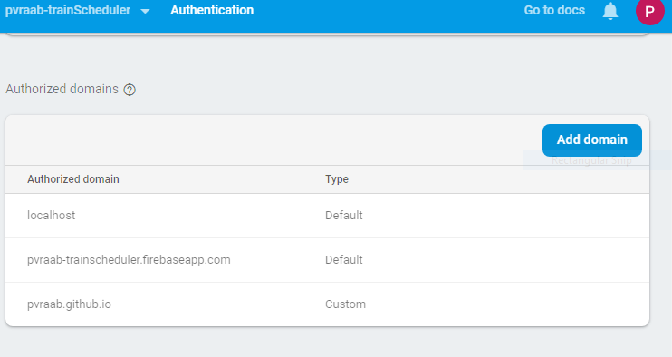

# TrainScheduler
Manage Train Schedules

### Overview

Create a train schedule application that incorporates Firebase to host arrival and departure data. This app stores and retrieves data from the Firebase DB, stores it in a table, and dynamically updates  train arrival times.  and manipulate this information with Moment.js. This website provides up-to-date information about various trains, namely their arrival times and how many minutes remain until they arrive at their station. The user can add trains, update trains, and delete trains. The user must login wo use this app. A Google login is provided.

- - -

### GitHub Access

* [Source code repository](<https://github.com/pvraab/TrainScheduler>)
* [Application website](https://pvraab.github.io/TrainScheduler/index.html)

### Detailed Functionality

* When adding trains, administrators are able to submit the following:
    * Train Name
	* Destination 
	* First Train Time -- in military time
	* Frequency -- in minutes
* This app calculates when the next train will arrive; this time is relative to the current time.
* Users from many different machines are able to view same train times.
* Users can update train information or remove specific trains. The user can edit the row's elements-- change a train's Name, Destination and Arrival Time (and then, by relation, minutes to arrival).
* A  login screen is provided to restrict access.
* The train data "minutes to arrival" and "next train time" are updated every minute.
* * Try adding `update` and `remove` buttons for each train. Let the user edit the row's elements-- allow them to change a train's Name, Destination and Arrival Time (and then, by relation, minutes to arrival).

### Challenges

The biggest challenge was synchronizing the Firebase DB with multiple user views and making sure everyone was seeing the correct data. The Firebase authentication was also interesting. The GitHub webpage needed to be added to the "Authorized Domains" in the Firebase Authentication section.

### Technologies Used

- JavaScript
- jQuery
- Firebase
- Moment.js
- Firebase Authentication
- Google Authentication
- Polished Front-End - using Bootstrap
- Good Quality Coding Standards used
- No alerts, confirms, or prompts
- Deployed on GitHub
